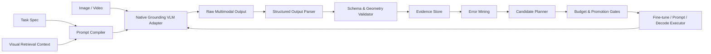

# VLM Agent

面向目标识别、开放词汇检测、视觉定位与视觉推理的 **native-grounding VLM optimization harness**。

本项目参考 [whut09/YOLO-Agent](https://github.com/whut09/YOLO-Agent) 的状态机、证据契约、实验图、预算调度、错误挖掘和 loop engineering，但研究对象不再是固定类别检测器，也不是机器人 VLA。项目聚焦能够直接理解图像并输出目标类别、边界框、点坐标、数量、属性、关系和解释的视觉语言模型，例如 Qwen3-VL、GLM-V、Molmo2 等原生具备 grounding/pointing 能力的模型。

> 当前阶段：方案设计与架构规划。仓库暂不宣称已完成训练、评测或生产部署。

## 项目定位

VLM Agent 可以理解为“从 YOLO 自动优化系统升级到开放语义视觉定位系统”，但核心模型不依赖 YOLO、GroundingDINO 或其他外部检测器作为主路径。

输入：

- 一张或多张图片、视频帧或裁剪区域。
- 自然语言查询、类别列表、属性约束或关系描述。
- 可选的任务 schema、输出格式、示例和检索上下文。

输出：

- 目标名称、开放词汇描述和置信信息。
- bounding boxes、points、regions 或目标间空间关系。
- 计数、属性、OCR 结果和定位解释。
- 结构化 JSON、可视化结果、原始模型响应和验证报告。

典型任务：

- “找出图中所有戴安全帽的人并给出框。”
- “定位离红色车辆最近的行人。”
- “图中有几个灭火器？分别在哪里？”
- “找到包装上生产日期的位置并读取文字。”
- “定位与参考图中同类的缺陷，即使类别没有出现在训练标签中。”

## 非目标

- 不做机械臂、动作控制、VLA policy 或真实机器人强化学习。
- 不把 YOLO 与 GroundingDINO 组成必选的级联系统。
- 不把一个固定 prompt 包装成应用后就声称是 Agent。
- 不只比较通用问答 benchmark，而忽略框坐标、漏检、幻觉和延迟。

## 核心技术判断

### 原生 Grounding VLM 是主路径

模型直接从图像和文本生成目标、框、点或区域。Harness 负责统一 prompt、坐标、解析、验证、评测和优化，不在主路径中依赖独立检测器。

### 模型不在架构中写死

Qwen3-VL 是首选 baseline 候选，因为其官方能力覆盖目标识别、开放词汇 2D grounding、点定位、OCR 和视觉推理；但最终默认模型由本地实验决定。首轮候选：

| 候选 | 定位 | 首轮用途 |
|---|---|---|
| [Qwen3-VL](https://github.com/QwenLM/Qwen3-VL) | 通用视觉理解、grounding、pointing、多尺寸开源权重 | 默认 baseline 候选 |
| [GLM-V](https://github.com/zai-org/GLM-V) | 视觉推理与精确 grounding，提供本地尺寸模型 | 结构化定位对照 |
| [Molmo2](https://github.com/allenai/molmo2) | 开放权重、pointing、图像与视频 grounding | 点定位与视频扩展对照 |

选择标准不是“榜单最高”，而是：

- 目标定位精度和开放词汇泛化。
- 结构化输出有效率和坐标协议稳定性。
- 小目标、密集目标、长尾类别和中文查询表现。
- 显存、吞吐、首 token 延迟和单图成本。
- 微调工具链、许可证、量化与本地部署成熟度。

建议先用能在现有 GPU 上稳定运行的 4B–10B 级模型打通 harness，再决定是否扩展更大模型。模型尺寸和量化配置属于实验变量，不属于架构常量。

## 统一任务协议

```json
{
  "task": "grounding",
  "query": "定位所有没有佩戴安全帽的人",
  "image": "images/site_001.jpg",
  "output_schema": "grounding.v1",
  "coordinate_space": "normalized_1000",
  "return_explanation": true
}
```

统一结果：

```json
{
  "objects": [
    {
      "label": "未佩戴安全帽的人",
      "box": [112, 84, 376, 941],
      "point": [244, 430],
      "confidence": 0.81,
      "evidence": "头部区域未观察到安全帽"
    }
  ],
  "model": "model-adapter-id",
  "raw_response_artifact": "...",
  "validation": {
    "schema_valid": true,
    "coordinates_valid": true
  }
}
```

模型原始坐标可能采用像素、0–1、0–1000、特殊 box token 或文本坐标。Adapter 必须转换到统一内部坐标，同时保存原始响应，禁止在无法解析时静默猜测。

## 总体架构



完整设计见 [docs/architecture.md](docs/architecture.md)。

## Loop Engineering

```text
init
  -> validate_environment
  -> profile_dataset
  -> build_research_snapshot
  -> run_baseline
  -> evaluate_grounding
  -> diagnose_errors
  -> build_visual_index
  -> generate_candidates
  -> smoke_inference
  -> fine_tune_or_prompt_optimize
  -> evaluate_candidate
  -> compare_and_promote
  -> mine_hard_samples
  -> dataset_promote
  -> report
  -> next_round
```

每个 stage 声明 `requires`、`provides`、`evidence_required`、`retry_policy`、`budget_contract` 和 `artifact_contract`。缺失标注、坐标协议、baseline 或评测覆盖时进入 blocked，而不是继续生成不可信结论。

## 可从 YOLO-Agent 迁移

直接泛化：

- loop state、stage contract、event log、artifact manifest。
- evidence store、decision ledger、execution queue、experiment graph。
- dataset versioning、budget optimizer、ASHA、Pareto promotion。
- orchestrator、stage runner、candidate planner、report。
- frozen research snapshot、组件 registry、复现队列和消融计划。

需要重写：

- COCO-only task spec 改成 detection/grounding/pointing/counting/OCR/relations。
- Ultralytics executor 改成 Transformers/vLLM/SGLang/API/native model executors。
- YOLO 输出 importer 改成生成式 box/point parser 和坐标 normalizer。
- 检测错误分类扩展为 grounding、language、format、hallucination 和 reasoning 错误。
- 固定类别数据策略改成开放词汇 ontology、表达式和 hard negative 策略。

## 数据与评测

第一阶段按能力拆分数据集，而不是只混合成一个大训练集：

| 能力 | 建议数据 |
|---|---|
| 通用目标检测 | COCO、Objects365、OpenImages |
| 长尾与开放词汇 | LVIS、ODinW |
| 指代表达定位 | RefCOCO、RefCOCO+、RefCOCOg |
| phrase grounding | Flickr30k Entities、Visual Genome |
| 点定位与计数 | PointQA、CountBench 或自构造 point/count 数据 |
| 文档与 OCR 定位 | DocLayNet、TextOCR、企业自有文档数据 |
| 领域任务 | 从 YOLO 格式转换并增加自然语言 query 的自有数据 |

核心指标：

- detection/grounding：AP、AP50、Recall、Acc@IoU、mean IoU。
- open vocabulary：base/novel、rare/common/frequent、unseen query 表现。
- counting：MAE、exact match、count-conditioned localization。
- structured output：JSON valid rate、box parse rate、coordinate validity。
- reliability：hallucinated object rate、duplicate rate、miss rate、calibration。
- efficiency：显存、吞吐、首 token、总延迟、输出 token 和单图成本。

## 视觉检索与 Visual RAG

Visual RAG 只增强原生 VLM 推理，不替代定位模型：

- 检索相似场景、同类目标、长尾类别和 hard negative。
- 检索标注过的 few-shot grounding 示例。
- 检索类别定义、属性约束、关系规则和领域术语。
- 将检索结果编译成受控 multimodal context，并记录来源和 split。

必须比较：无检索、随机示例、文本示例、视觉示例、视觉 + hard negative。训练、验证和测试间禁止近重复图片或相同视频帧泄漏。

## 训练与后训练

建议风险和成本递增：

```text
prompt / decoding baseline
  -> LoRA SFT for structured grounding
  -> hard-negative SFT
  -> preference optimization for valid and precise outputs
  -> reward-based post-training for localization and reasoning
```

强化学习在本项目中指 VLM 后训练，不是机器人在线 RL。Reward 可以组合 schema validity、IoU、coverage、重复框、幻觉、解释一致性和长度成本，但必须防止通过少输出或固定格式投机。

## 里程碑

- **M0 Harness Skeleton**：typed schemas、状态机、证据、队列、CLI、resume。
- **M1 Native Grounding Baseline**：首个模型 adapter、prompt compiler、box/point parser、可视化。
- **M2 Grounding Evaluation**：COCO/RefCOCO 风格评测、错误分类、对比报告。
- **M3 Visual Retrieval**：视觉示例索引、hard negative、检索 trace 和消融。
- **M4 Fine-tuning Loop**：LoRA SFT、dataset promotion、budget 和 Pareto gate。
- **M5 Post-training**：preference/reward contract、定位 reward、可靠性优化。
- **M6 Research-to-Experiment**：冻结论文快照、复现队列、recipe critic 和消融。

## 文档

- [架构设计](docs/architecture.md)
- [模型、数据集与论文地图](docs/research-map.md)

Codex 分段 prompts 不写入仓库，由开发阶段按当前代码状态单独生成和执行。

## License

[MIT](LICENSE)
