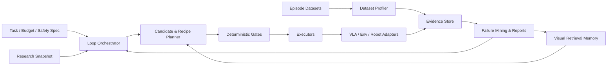

# VLM Agent

面向 Vision-Language-Action（VLA）研究、训练、评测与持续优化的 **evidence-driven agent harness**。

本项目参考 [whut09/YOLO-Agent](https://github.com/whut09/YOLO-Agent) 的状态机、证据契约、实验图、预算调度、论文快照和 loop engineering 思路，但不把 VLA 简化成“换一个模型的目标检测”。VLA 的核心对象是带时序、动作、机器人本体和环境反馈的 episode，因此本项目围绕 **模型适配、轨迹数据、视觉检索/视觉 RAG、强化学习、安全门控和可恢复实验循环** 重新设计。

> 当前阶段：架构与实施计划。仓库暂不宣称已经具备可用的训练或真机控制能力。

## 项目目标

- 用统一 adapter 接入 SmolVLA、OpenVLA/OFT、π0/openpi、GR00T 等不同动作表示的 VLA。
- 用统一 episode contract 管理 LeRobot、RLDS/Open X-Embodiment、LIBERO、DROID、BridgeData V2 和自采数据。
- 建立离线视觉检索与在线 episodic memory，检索相似场景、成功轨迹、失败案例和技能片段。
- 建立从 SFT、离线强化学习、仿真在线强化学习到受控真机 fine-tuning 的渐进训练链。
- 把建议、训练、评测、晋级和回滚绑定到可复现 evidence，而不是只依赖 LLM 文本判断。
- 把论文阅读转化为冻结的 research snapshot、组件契约、复现队列和可消融 recipe。
- 面向 harness engineering 与 loop engineering，而不是只提供一次性 notebook。

## 第一阶段技术选择

第一版采用“一主两辅”的适配策略：

| 角色 | 建议选择 | 用途 |
|---|---|---|
| 默认开发模型 | [SmolVLA / LeRobot](https://huggingface.co/blog/smolvla) | 工具链完整，适合先打通 contract、训练和评测 |
| 主研究模型 | [OpenVLA-OFT](https://github.com/moojink/openvla-oft) | 研究 action chunk、连续动作、LIBERO 与后续 RL |
| 扩展验证模型 | [openpi](https://github.com/Physical-Intelligence/openpi) 或 [Isaac-GR00T](https://github.com/NVIDIA/Isaac-GR00T) | 验证 flow/diffusion policy、跨本体与大模型适配边界 |

第一阶段默认闭环：

```text
LeRobot-format sample dataset
  -> dataset profile / validation
  -> SmolVLA baseline SFT
  -> replay evaluation
  -> LIBERO simulation evaluation
  -> failure mining
  -> visual retrieval index
  -> retrieval-aware candidate
  -> deterministic promotion gate
```

不建议一开始直接训练大规模 π0/GR00T，也不建议第一版进行无保护的真机在线 RL。先用较小模型和仿真环境验证 harness，再扩大算力与机器人范围。

## 总体架构



完整设计见 [docs/architecture.md](docs/architecture.md)。

## Loop Engineering

Loop orchestrator 是可恢复状态机，不是脚本拼接。建议默认 stage：

```text
init
  -> validate_environment
  -> profile_dataset
  -> build_research_snapshot
  -> build_retrieval_index
  -> run_baseline
  -> evaluate_baseline
  -> diagnose_failures
  -> generate_candidates
  -> safety_review
  -> smoke_train
  -> full_train
  -> rollout_eval
  -> compare_and_promote
  -> mine_episodes
  -> dataset_promote
  -> report
  -> next_round
```

每个 stage 必须声明：

- `requires` 与 `provides`。
- `block_on_missing`：缺失证据时阻塞，而不是猜测。
- `retry_policy`：可重试错误、次数与退避。
- `budget_contract`：GPU 小时、rollout 数、真机分钟和人工干预上限。
- `safety_contract`：动作范围、碰撞、急停、workspace 和人工批准。
- `artifact_contract`：格式、schema 版本、哈希与 lineage。

## Harness 分层

```text
vlm_agent/
  core/             # state, contracts, event log, evidence, lineage, queue
  harness/          # orchestrator, stage runners, promotion and resume
  adapters/
    models/         # smolvla, openvla_oft, openpi, groot
    datasets/       # lerobot, rlds, libero, droid, bridge
    envs/           # libero, robosuite, isaac, real_robot
    robots/         # embodiment-specific observation/action conversion
  retrieval/        # encoders, indexes, rerankers, episodic memory
  training/         # sft, offline_rl, online_rl, reward and rollout workers
  evaluation/       # replay, sim, real, robustness, latency, safety
  research/         # paper registry, snapshot, component and recipe extraction
  agents/           # planner, critic, failure analyst, budget advisor
  reports/          # run, comparison, ablation and next-round reports
```

### 可从 YOLO-Agent 迁移

优先迁移并泛化：

- `core/loop_state.py`、`evidence_store.py`、`evidence_contract.py`。
- `core/artifact_manifest.py`、`event_log.py`、`decision_ledger.py`。
- `core/execution_queue.py`、`experiment_graph.py`、`command_spec.py`、`executor.py`。
- `core/dataset_versioning.py`，改为 episode/chunk/trajectory aware manifest。
- `agents/orchestrator.py`、`stage_runner.py`、`candidate_generator.py`。
- ASHA、successive-halving、budget、Pareto 等确定性策略。
- `research/` 的 snapshot、registry、component、recipe 与 reproduction pipeline。
- `reports/` 的 run summary、cross-run comparison 和 next-round。

必须重写：

- COCO、检测框、mAP 和 Ultralytics adapter。
- 单图错误分类；VLA 需要时序 failure taxonomy。
- 晋级指标；VLA 需要 success、safety、latency、smoothness 和 intervention 综合门控。
- 数据切分；必须按 scene/task/robot/operator/time 做 group split，避免相邻帧泄漏。

## 视觉检索与视觉 RAG

视觉 RAG 不应只把截图向量化后拼进 prompt。第一版设计四类 memory：

1. **Semantic memory**：任务、对象、场景、机器人和技能文本。
2. **Visual memory**：关键帧、短视频片段、物体 crop、深度或点云摘要。
3. **Action memory**：动作 chunk、末端轨迹、夹爪状态和 proprioception。
4. **Outcome memory**：成功、失败类型、人工干预、reward 和安全事件。

检索采用 coarse-to-fine：metadata filter → multimodal ANN → temporal reranker → embodiment compatibility gate。默认只把结果用于 planner/context 或显式 adapter 输入，不在没有消融的情况下直接改变底层动作分布。

关键实验包括：无检索、随机检索、成功 episode、成功 + hard negative、frame vs trajectory、late-fusion vs memory token、同本体 vs 跨本体，以及 split/近重复污染审计。

## 强化学习路线

```text
SFT baseline
  -> offline preference / value learning
  -> offline RL on fixed episodes
  -> simulation online RL
  -> shadow-mode real evaluation
  -> human-intervention real fine-tuning
```

建议先复现 [ConRFT](https://arxiv.org/abs/2502.05450) 的 offline/online reinforced fine-tuning 思路，再把 [SimpleVLA-RL](https://arxiv.org/abs/2509.09674) 风格的 outcome reward 与并行 rollout 作为独立 executor 接入。RL 不是默认自动开启的 stage，必须通过 baseline、仿真、安全和预算 gate。

## Evidence 与晋级规则

每个候选至少记录：

- Git commit、环境锁、模型与数据集 hash。
- embodiment、observation/action schema 与归一化统计。
- seed、训练预算、GPU、吞吐、显存和 checkpoint lineage。
- task success、failure taxonomy、碰撞、越界和 intervention。
- action latency、control frequency、trajectory smoothness 与长时稳定性。
- retrieval score、来源 episode、时间区间和 split。
- research snapshot hash、prompt hash、LLM 输出与 deterministic gate。

默认采用 Pareto gate：

```text
success_delta >= threshold
AND safety_regression == false
AND latency_within_budget == true
AND evaluation_coverage >= minimum
AND evidence_contract_complete == true
```

## 数据集与评测建议

| 阶段 | 数据/环境 | 目的 |
|---|---|---|
| Contract 开发 | LeRobot 小型数据或 toy episodes | 验证 schema、加载、切分、hash |
| 模型 baseline | LeRobot + SmolVLA 兼容数据 | 打通训练与 replay eval |
| 研究基准 | [LIBERO](https://libero-project.github.io/) | 长时任务、迁移和遗忘评测 |
| 跨本体预训练 | [Open X-Embodiment](https://robotics-transformer-x.github.io/) / RLDS | 多机器人、多任务统一 |
| 真机泛化 | DROID、BridgeData V2 或目标机器人自采集 | 场景与本体适配 |
| 合成与扩展 | RoboTwin / Isaac Lab | RL rollout、扰动和安全测试 |

数据晋级单位应是 episode manifest，不是文件夹复制。切分必须保存 group key，并进行 near-duplicate 检测。

## 论文与组件地图

```text
paper sync
  -> deduplicate / classify
  -> extract claims and components
  -> license / code / checkpoint audit
  -> embodiment compatibility review
  -> reproduction contract
  -> frozen research snapshot
  -> candidate recipe
  -> ablation and promotion
```

初始阅读与复现列表见 [docs/research-map.md](docs/research-map.md)。

## 实施里程碑

- **M0 Harness Skeleton**：typed schemas、状态机、事件日志、artifact、queue、doctor、resume。
- **M1 SmolVLA + LeRobot**：dataset adapter、SFT executor、replay 与 LIBERO evaluator。
- **M2 Failure + Retrieval**：时序错误分类、multimodal index、lineage、leakage guard。
- **M3 OpenVLA-OFT**：continuous action chunk、多模型能力矩阵、预算调度。
- **M4 RL Loop**：offline RL、并行仿真 rollout、安全门控和人工干预记录。
- **M5 Research-to-Experiment**：冻结论文快照、复现队列、recipe critic 和消融。

## Codex 分段实施

不要用一个超长 prompt 一次实现完整 VLA Agent。按阶段执行、每段验证、每段提交：

- [docs/codex-prompts.md](docs/codex-prompts.md)
- [docs/architecture.md](docs/architecture.md)
- [docs/research-map.md](docs/research-map.md)

## License

[MIT](LICENSE)

